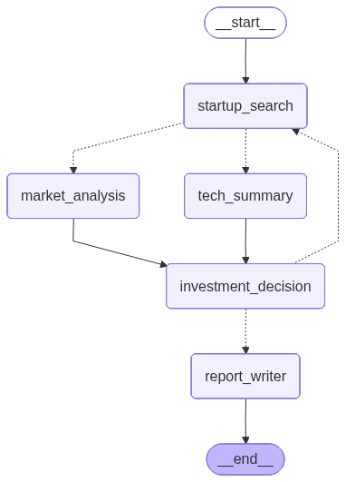
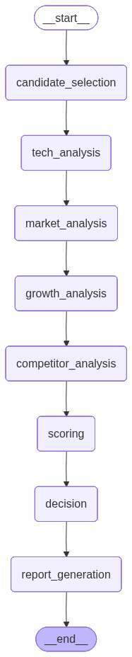

# 위성 우주항공산업 AI 스타트업 투자 분석 보고서 
## 1. 변경사항 
### 1-1. search_agent 구조 변경 
`as-is` 
- 우주산업 동향 문서를 이용하여 스타트업 리스트를 선발

`to-be`
- 스타트업 특성상 업계의 흐름이 빠르기 때문에 ValidSearch를 이용하여 최신 동향에 맞춰 선별

### 1-2. 플로우 구조 변경 
`as-is` 




`to-be`
- 초기 설계에서는 기업 A 및 관련 경쟁사를 탐색할 때, search-agent 단계에서 경쟁사를 선별하도록 구성하였으나,
해당 방식은 선정된 경쟁사가 기업 A와 동일 산업·기술 영역을 충분히 반영하지 못하는 문제가 발생하였습니다.
이에 따라 경쟁사 탐색 로직을 별도 후처리 단계로 분리하고, 기업 A의 핵심 비즈니스·기술 키워드를 기반으로 재선정하는 구조로 개선하였습니다. 


 

### 1-3. 시장 성장률 계산 OPEN API로 변경 
- 기존에는 고정된 벤치마크 수치(예: 6.1%)나 제한된 검색 데이터를 활용하여 시장 성장률을 산출했으나,
이 방식은 최신 경기 상황을 반영하기 어렵고 신뢰도가 낮다는 한계가 있었습니다.

- 이에 따라 한국은행 ECOS OPEN API를 연동하여,
GDP 성장률(코드 200Y001) 및 산업생산지수(코드 901Y009) 등 주요 경제지표를 실시간으로 수집하고,
다음과 같은 절차를 통해 시장 성장률을 자동 산출하는 구조로 개선하였습니다.

1. 데이터 수집

- ECOS API를 통해 지정 기간(2023 ~ 2024) 경제지표 데이터를 자동 조회

- 월간 산업생산지수 24개월치를 기준으로 최근 12개월 vs 이전 12개월 평균 비교

- 성장률 계산
```
growth_rate = ((recent_avg - prev_avg) / prev_avg) * 100
```
- 예시 결과: 산업생산지수 기준 –1.45 %

2. 우선순위 체계화
- 산업생산지수 (실제 성장률 산출)
- 벤치마크 데이터 (6.1 %) – 보조
- 검색결과 –> 최종 백업

이를 통해 시장 분석 단계에서 실제 통계 기반의 신뢰도 높은 성장률을 반영할 수 있으며,
분석 보고서의 객관성과 재현성을 동시에 확보하였습니다.


## 2. 트러블 슈팅 
### 2-1. 스타트업 한정 인력에 대한 정보를 추출하기 제한적임
- 다수의 스타트업은 공개된 인력 정보가 제한적이어서, 핵심 인력 구성이나 팀 역량을 정량적으로 분석하기 어려웠음.

- 특히 내부 조직도나 인원 세부 정보는 비공개인 경우가 많아, 웹 검색만으로는 인력 관련 데이터를 충분히 확보하기 어려움.

->  추가 개발: 이에 따라, 공식 보도자료·기업 소개서·IR 문서 중심으로 보완적 수집 체계를 구축함

### 2-2. PDF 변환 작업 
- 초기에는 다양한 문서 형식(DOCX, HTML, Markdown)을 PDF로 변환하는 과정에서 서식 손실·한글 폰트 깨짐·레이아웃 오류가 발생함.
- 이를 해결하기 위해 ReportLab 라이브러리 기반의 PDF 생성 파이프라인으로 전환함.
- reportlab.platypus를 이용해 텍스트·표·차트를 직접 구성하여 일관된 출력 품질 확보
- 한글 폰트(UnicodeCIDFont('HYSMyeongJo-Medium')) 등록으로 CJK 폰트 깨짐 문제 해결
- 결과적으로, PDF 생성 속도와 안정성 모두 개선되었으며, 문서 자동화 프로세스의 신뢰도를 확보함.
